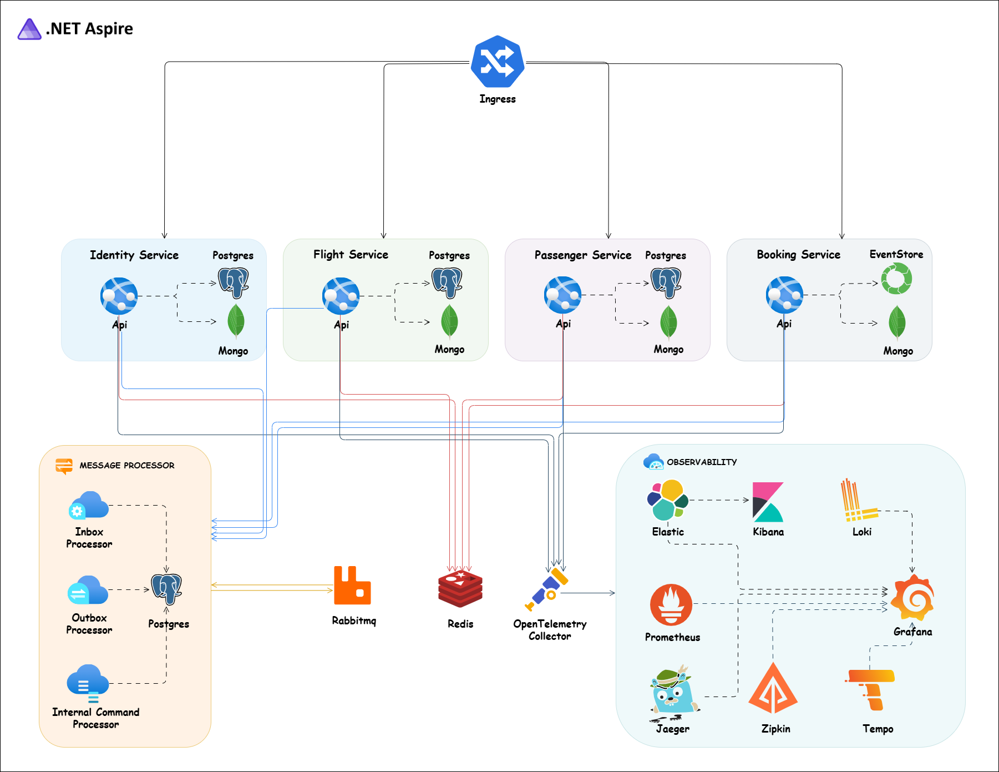
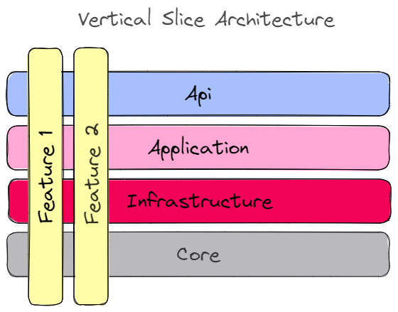

<div align="center">
  
  <p>
    <a href="https://github.com/evangelosvlachos96-dotcom/booking-microservices/actions/workflows/ci.yml"></a>
  </p>
</div>

# Booking Microservices

> A practical flight-booking system built as microservices with **.NET 10**, using Vertical Slice Architecture, DDD, CQRS, Event Sourcing, gRPC, RabbitMQ, Wolverine, PostgreSQL, MongoDB and .NET Aspire.

Developed by **Evangelos Vlachos**.

## Table of Contents

- [Overview](#overview)
- [Architecture](#architecture)
- [Services](#services)
- [Technology Stack](#technology-stack)
- [Project Structure](#project-structure)
- [Getting Started](#getting-started)
  - [Prerequisites](#prerequisites)
  - [Dev Certificate](#dev-certificate)
  - [Run with Aspire](#run-with-aspire)
  - [Run with Docker Compose](#run-with-docker-compose)
  - [Run with Kubernetes](#run-with-kubernetes)
  - [Build, Run and Test manually](#build-run-and-test-manually)
- [API Documentation](#api-documentation)
- [Development Tooling](#development-tooling)
- [Contributing](#contributing)

## Overview

This repository demonstrates how to design and run a production-style microservices system end to end: independent services with their own databases, asynchronous messaging with durable inbox/outbox, synchronous gRPC calls between services, an API gateway, centralized identity, observability and container/Kubernetes deployment.

Key goals:

- **Vertical Slice Architecture** with feature folders. Each request is one self-contained slice.
- **Domain Driven Design** for all business logic.
- **CQRS** with MediatR, plus validation and logging pipeline behaviours.
- **Event Sourcing** (EventStoreDB) for the write side of the Booking service.
- **Event Driven Architecture** with RabbitMQ on top of Wolverine, using durable **inbox** (idempotent, exactly-once processing) and **outbox** (at-least-once delivery) patterns.
- **gRPC** for internal service-to-service communication.
- **PostgreSQL** for write models, **MongoDB** for read models.
- **Unit, integration, end-to-end and contract tests** (NSubstitute, Testcontainers, PactNet).
- **Observability** with OpenTelemetry, Jaeger, Prometheus, Grafana and Serilog/Kibana.
- **IdentityServer** (OpenID Connect / OAuth2) for authentication and authorization.
- **YARP** as the API gateway.
- **Docker Compose**, **Kubernetes** (Nginx Ingress, cert-manager) and **.NET Aspire** for orchestration.

## Architecture

<div align="center">
  
</div>

Each service owns its data and exposes a small REST surface through minimal APIs. Commands mutate the write store (PostgreSQL or EventStoreDB) and publish integration events through Wolverine's durable outbox to RabbitMQ. Consumers process those events through the durable inbox and project them into MongoDB read models. Queries read from MongoDB only. Cross-service reads that must be synchronous (for example Booking validating a flight or passenger) go over gRPC.

<div align="center">
  
</div>

## Services

| Service | Responsibility | Write store | Read store |
|---|---|---|---|
| **Identity** | Users, roles, tokens (IdentityServer) | PostgreSQL | - |
| **Flight** | Flights, airports, aircraft, seats | PostgreSQL | MongoDB |
| **Passenger** | Passenger profiles | PostgreSQL | MongoDB |
| **Booking** | Booking a seat on a flight for a passenger | EventStoreDB | MongoDB |
| **ApiGateway** | Single public entry point (YARP) | - | - |
| **Aspire AppHost** | Local orchestration and dashboard | - | - |

## Technology Stack

- [.NET 10](https://github.com/dotnet/aspnetcore), Minimal APIs, [API Versioning](https://github.com/microsoft/aspnet-api-versioning)
- [MediatR](https://github.com/jbogard/MediatR), [FluentValidation](https://github.com/FluentValidation/FluentValidation), [Mapster](https://github.com/MapsterMapper/Mapster)
- [Wolverine](https://wolverine.netlify.app/) + [RabbitMQ](https://www.rabbitmq.com/) for messaging, [MassTransit](https://masstransit.io/) contracts
- [gRPC](https://grpc.io/) with [Grpc.AspNetCore](https://github.com/grpc/grpc-dotnet)
- [Entity Framework Core](https://github.com/dotnet/efcore) + [PostgreSQL](https://www.postgresql.org/)
- [MongoDB](https://www.mongodb.com/), [EventStoreDB](https://www.eventstore.com/), [Redis](https://redis.io/)
- [Duende IdentityServer](https://duendesoftware.com/products/identityserver) (OpenID Connect / OAuth2)
- [YARP](https://microsoft.github.io/reverse-proxy/) reverse proxy
- [OpenTelemetry](https://opentelemetry.io/), [Jaeger](https://www.jaegertracing.io/), [Prometheus](https://prometheus.io/), [Grafana](https://grafana.com/), [Serilog](https://serilog.net/) + Kibana
- [Polly](https://github.com/App-vNext/Polly) resilience, ASP.NET Core Health Checks
- [Scalar](https://github.com/scalar/scalar) and Swagger for OpenAPI docs
- [xUnit](https://xunit.net/), [NSubstitute](https://nsubstitute.github.io/), [Testcontainers](https://dotnet.testcontainers.org/), [PactNet](https://github.com/pact-foundation/pact-net), [Bogus](https://github.com/bchavez/Bogus)
- [.NET Aspire](https://learn.microsoft.com/dotnet/aspire), Docker, Kubernetes, Nginx Ingress, cert-manager

## Project Structure

```
.
├── src
│   ├── ApiGateway/            # YARP gateway
│   ├── Aspire/                # Aspire AppHost and service defaults
│   ├── BuildingBlocks/        # Shared cross-cutting code (Core, EFCore, Mongo, Wolverine, Jwt, Logging, OpenTelemetry, Polly, TestBase, ...)
│   └── Services
│       ├── Booking/           # src/Booking, src/Booking.Api, tests/
│       ├── Flight/
│       ├── Identity/
│       └── Passenger/
├── deployments
│   ├── configs/               # otel-collector, prometheus, grafana configs
│   ├── docker-compose/        # infrastructure and full-stack compose files
│   └── kubernetes/            # manifests + cert-manager
├── assets/                    # diagrams and logo
├── booking.rest               # REST Client requests for manual API testing
└── booking-microservices.sln
```

Inside every service, code is grouped by **feature** (for example `Flights/Features/CreatingFlight/V1/`) rather than by technical layer. Each feature folder holds its endpoint, command/query, handler, validator and any events it raises, so a change to one use case touches only that folder.

## Getting Started

### Prerequisites

- [.NET 10 SDK](https://dotnet.microsoft.com/download)
- [Docker Desktop](https://www.docker.com/products/docker-desktop/)
- [Node.js](https://nodejs.org/) (for Husky commit hooks)
- Optional: [.NET Aspire CLI](https://learn.microsoft.com/dotnet/aspire/fundamentals/aspire-cli), `kubectl`

### Dev Certificate

Create and trust a development HTTPS certificate so the containers can serve TLS.

Windows (PowerShell):

```powershell
dotnet dev-certs https -ep $env:USERPROFILE\.aspnet\https\aspnetapp.pfx -p password
dotnet dev-certs https --trust
```

macOS / Linux:

```bash
dotnet dev-certs https -ep ${HOME}/.aspnet/https/aspnetapp.pfx -p password
dotnet dev-certs https --trust
```

### Run with Aspire

The fastest way to get everything up locally, with a dashboard for logs, traces and metrics:

```bash
aspire run
```

The Aspire dashboard is available at `http://localhost:18888`.

### Run with Docker Compose

Infrastructure only (RabbitMQ, PostgreSQL, EventStoreDB, MongoDB, Redis, Jaeger, Zipkin, OTel Collector, Prometheus, Grafana):

```bash
docker-compose -f ./deployments/docker-compose/docker-compose.infrastructure.yaml up -d
```

Full stack including the services:

```bash
docker-compose -f ./deployments/docker-compose/docker-compose.yaml up -d
```

### Run with Kubernetes

Install [cert-manager](https://cert-manager.io/docs/installation) first, then apply the TLS issuer and the application manifests:

```bash
kubectl apply -f ./deployments/kubernetes/booking-cert-manager.yml
kubectl apply -f ./deployments/kubernetes/booking-microservices.yml
```

> The manifests reference images under the `evangelosvlachos96/` Docker Hub namespace. Build and push the service images there (or change the image names) before deploying.

### Build, Run and Test manually

Build the whole solution from the repository root:

```bash
dotnet build
```

Run a single service from its `*.Api` project folder (for example `src/Services/Flight/src/Flight.Api`):

```bash
dotnet run
```

Run all tests (integration and end-to-end tests start their dependencies with Testcontainers, so Docker must be running):

```bash
dotnet test
```

## API Documentation

Every service exposes OpenAPI documentation at `/swagger` (Swagger UI) and `/scalar/v1` (Scalar).

For quick manual testing, open [booking.rest](./booking.rest) with the VS Code [REST Client](https://github.com/Huachao/vscode-restclient) extension. Seeded users are `van1` / `Admin@123456` (admin) and `van2` / `User@123456` (user).

## Development Tooling

**.NET tools** (CSharpier formatter, dotnet-outdated) are declared in `.config/dotnet-tools.json`:

```bash
dotnet tool restore
```

**Husky + commitlint** enforce [Conventional Commits](https://www.conventionalcommits.org/) and run the formatter before each commit:

```bash
npm install
```

**Upgrade NuGet packages** across the solution:

```bash
dotnet outdated -u
```

## Contributing

Issues and pull requests are welcome. Commit messages follow [Conventional Commits](https://www.conventionalcommits.org/) (`feat:`, `fix:`, `docs:`, `chore:`, `test:`, `refactor:`), which the Husky commit hook enforces.
